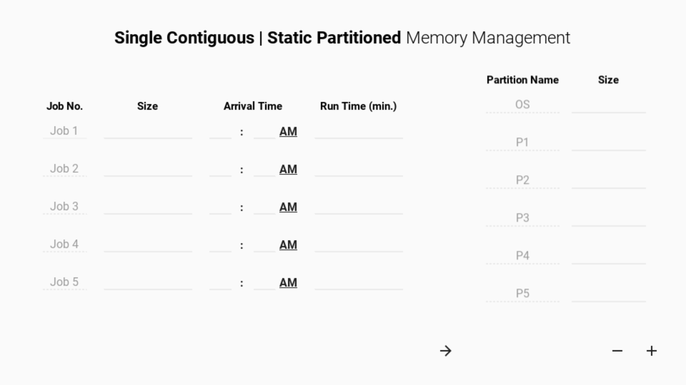
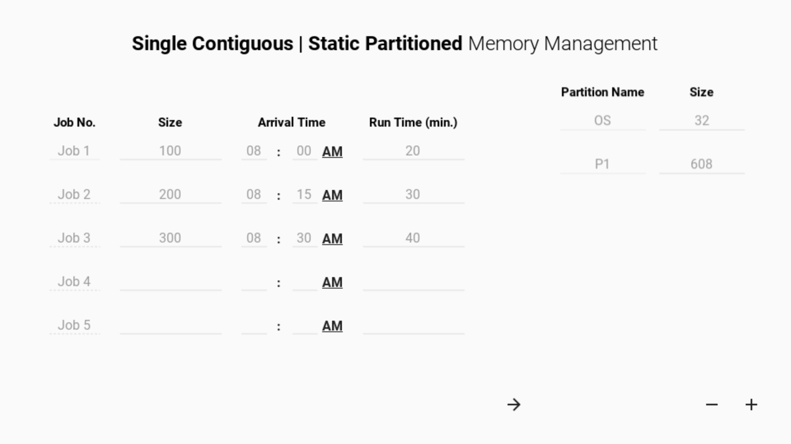
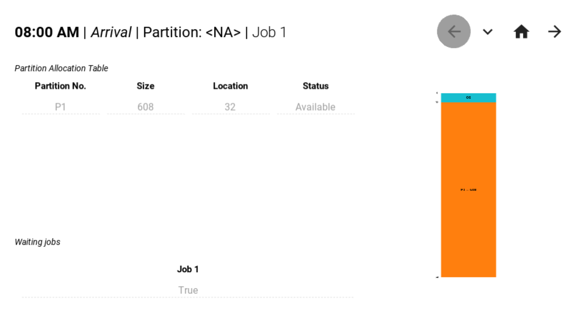
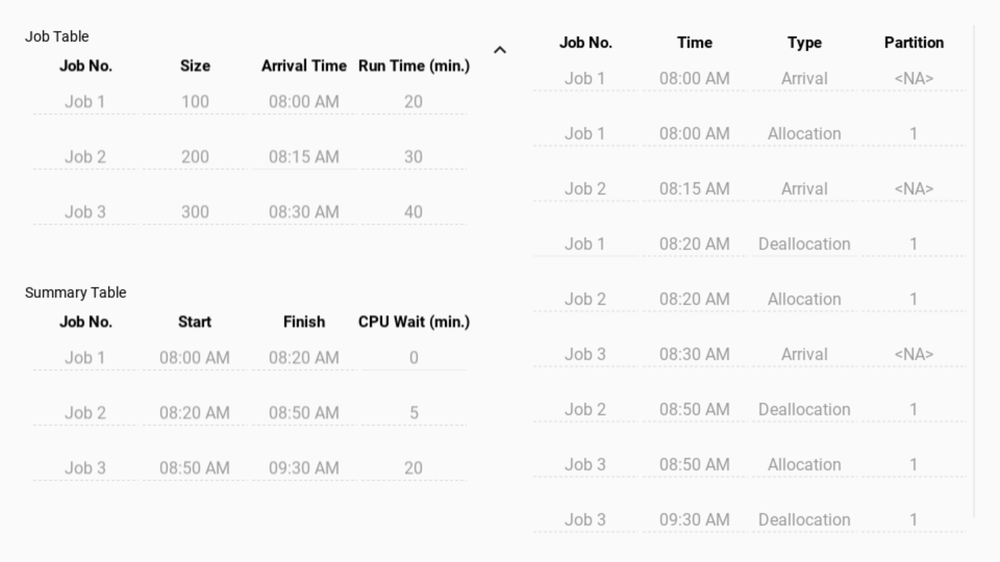
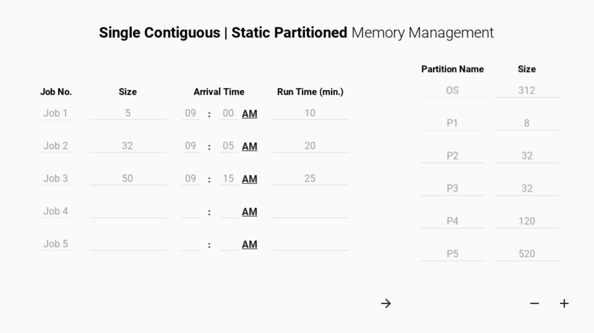
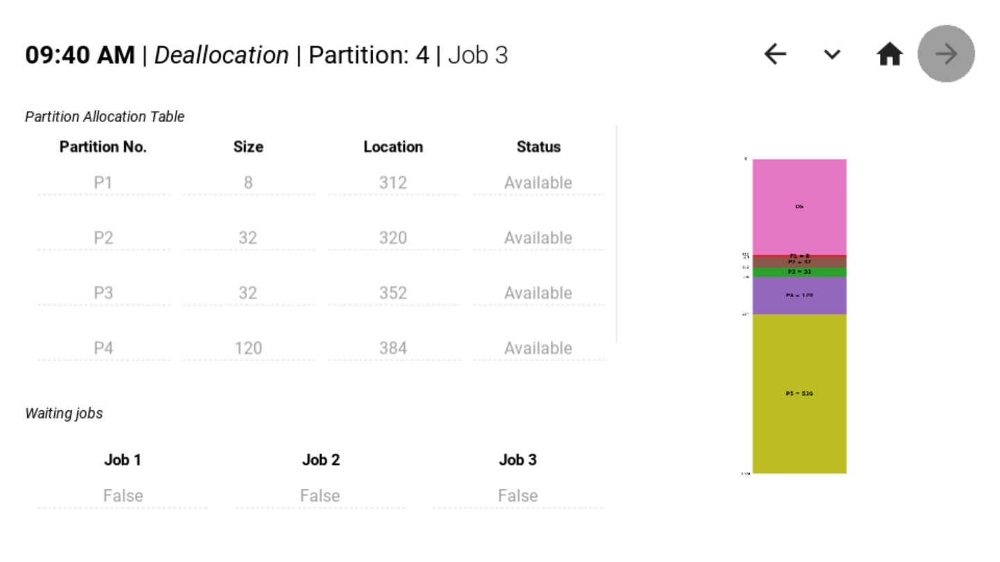
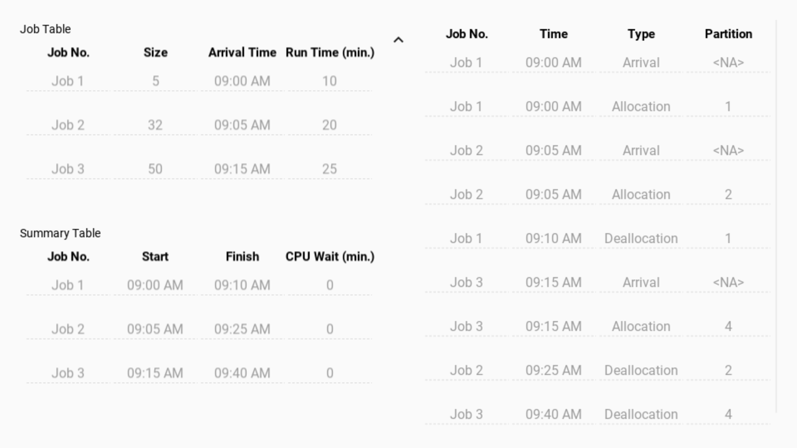

Directory for combined program of both **[Single Contiguous](#single-contiguous-memory)** and **[Static Partitioned](#static-partitioned-memory)** types of memory management.

> A _single contiguous_ memory can also be considered as a _single static partition_.

## Screenshots

### Single contiguous memory

### Static partitioned memory

