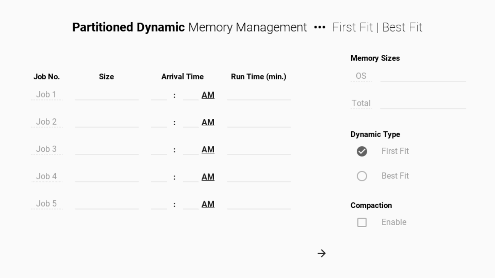
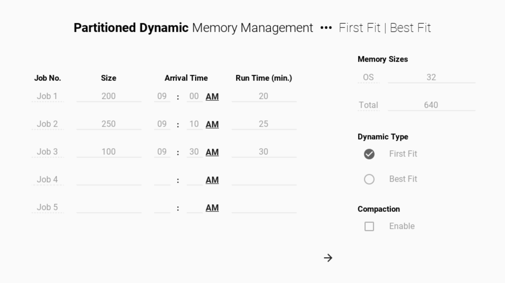
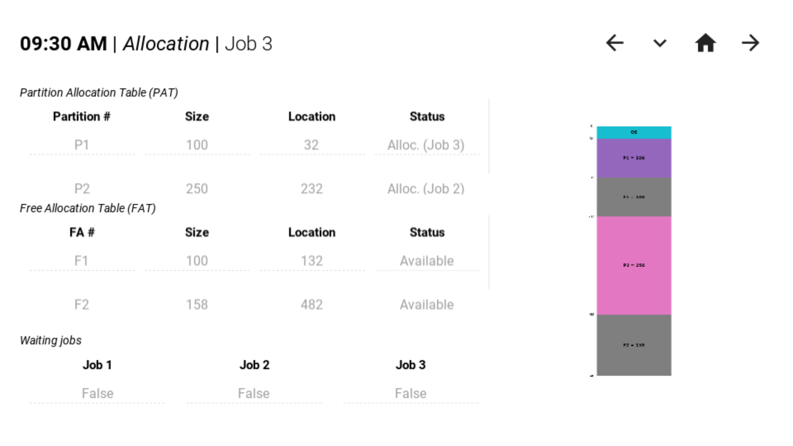
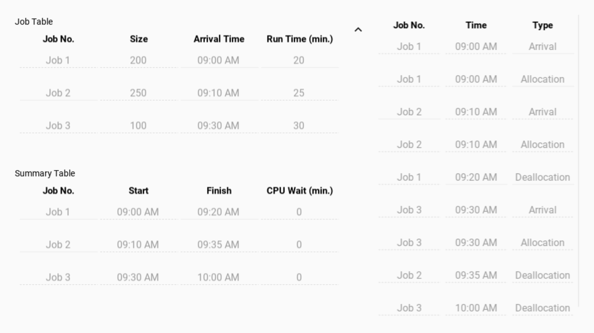

Directory of program for both types of Dynamic Partition memory management: **[First Fit](#first-fit)** and **[Best Fit](#best-fit)**

> _Dynamic partitions_ are allocated on runtime.

**Compaction** isolates free and allocated memories into contiguous blocks, i.e.

- Moves occupied partitions together, to the top (OS partition is considered occupied)
- Moves available partitions together, to the bottom

## Screenshots

### First fit

### Best fit

