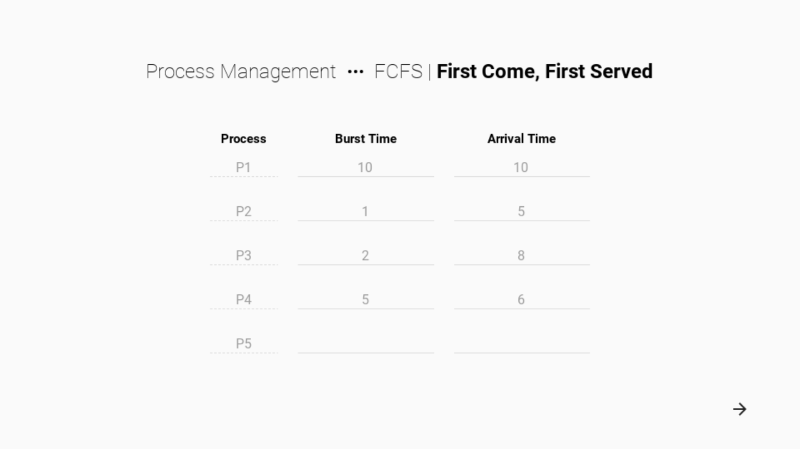
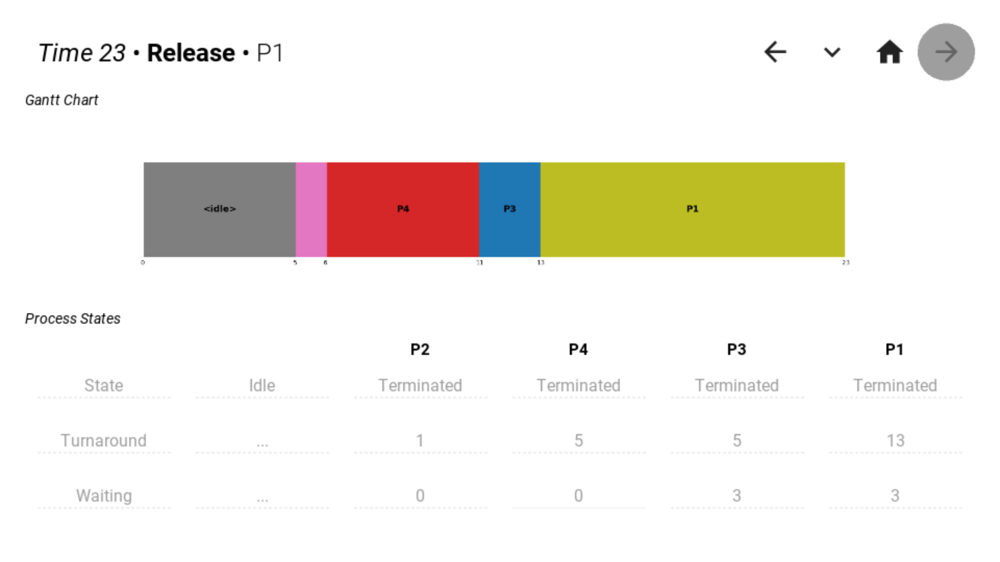
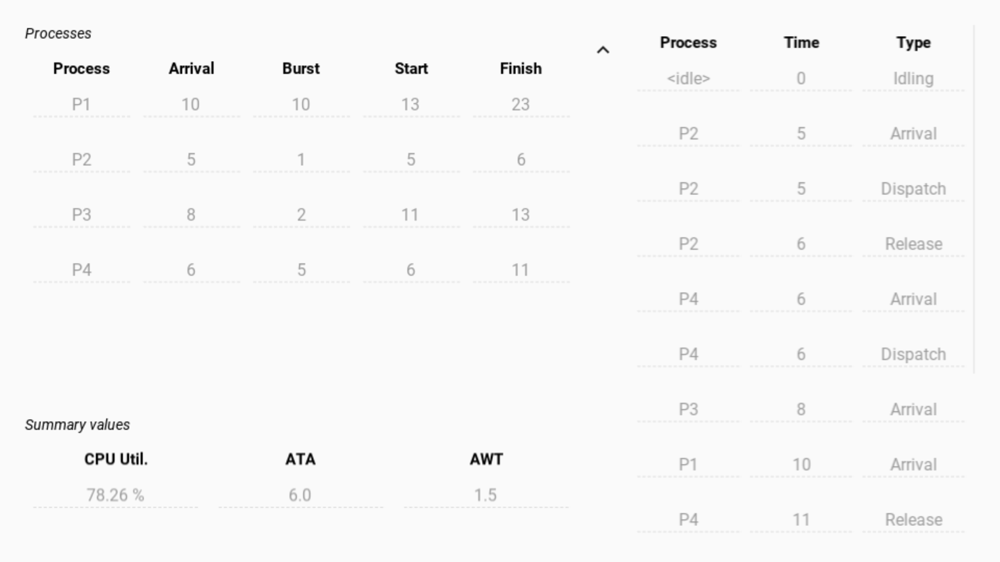

# First Come, First Served

- Non-preemptive CPU scheduling
- Processes are executed in turn based on their time of arrival
- Process queue is sorted by descending arrival time (earliest to latest)

## Screenshots

