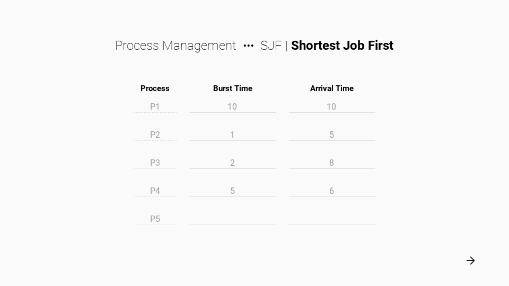
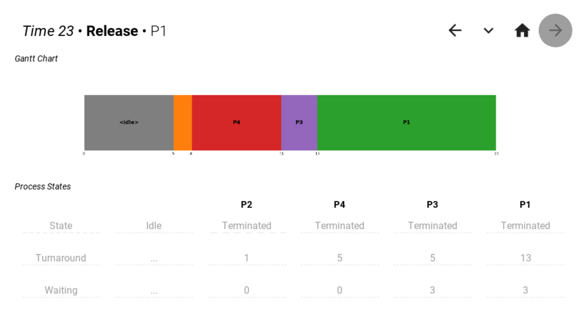
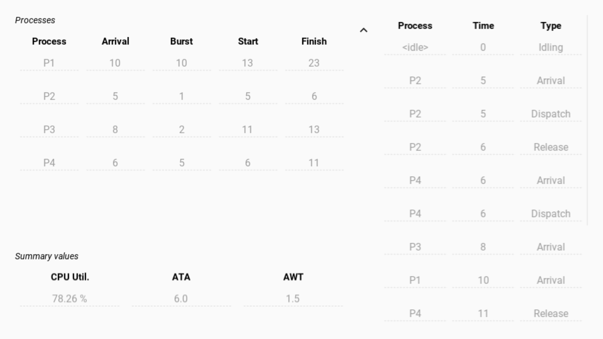

# Shortest Job First

- Non-preemptive CPU scheduling
- Processes are executed in turn based on their time of arrival
- Process queue is sorted by descending burst time (shortest to longest)

## Screenshots

