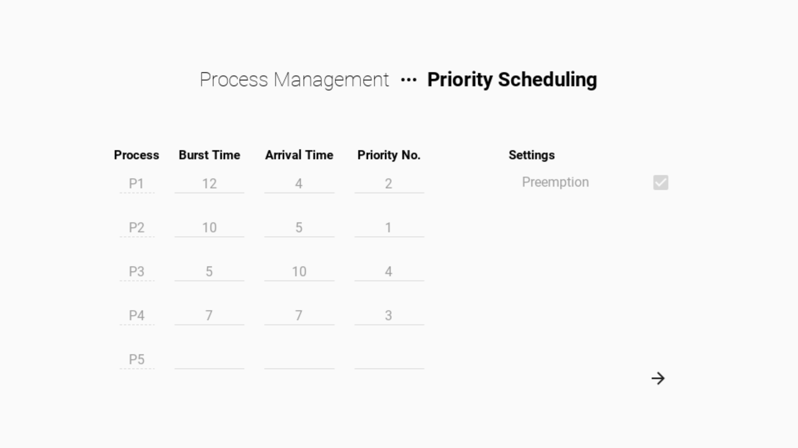
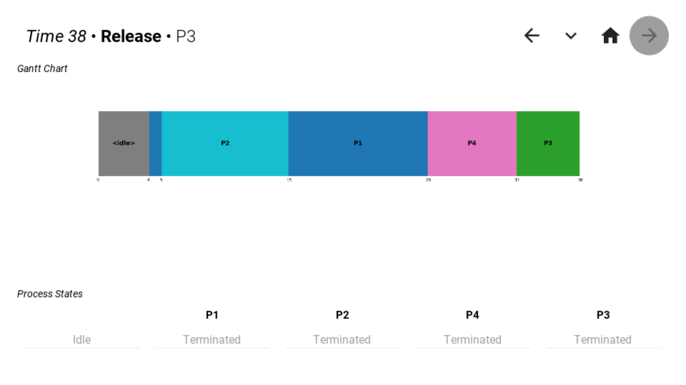
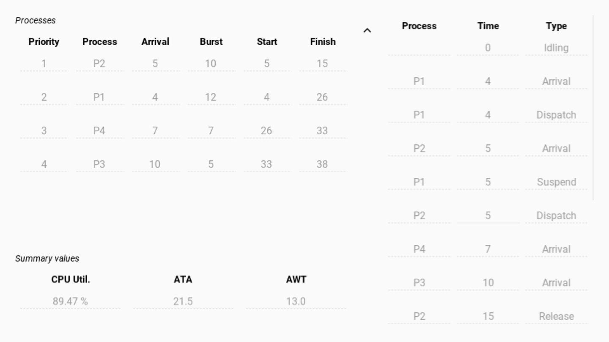

# Priority Scheduling

- Preemptive
  - If busy, CPU is interrupted when a more qualified process arrives
- Processes are executed based on their priority level
- Process queue is sorted by "descending" priority (lowest value 1 is highest priority)

## Screenshots

