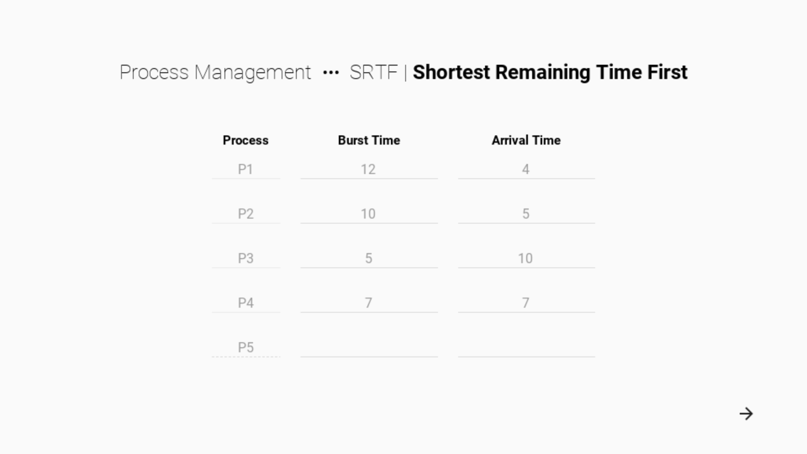
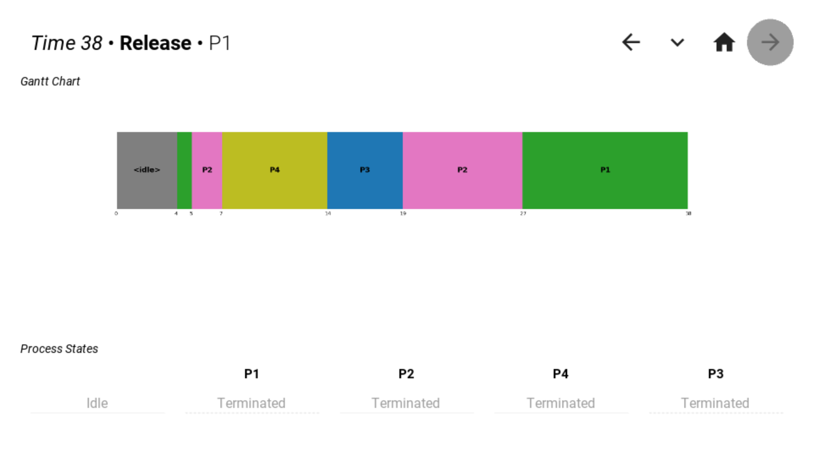
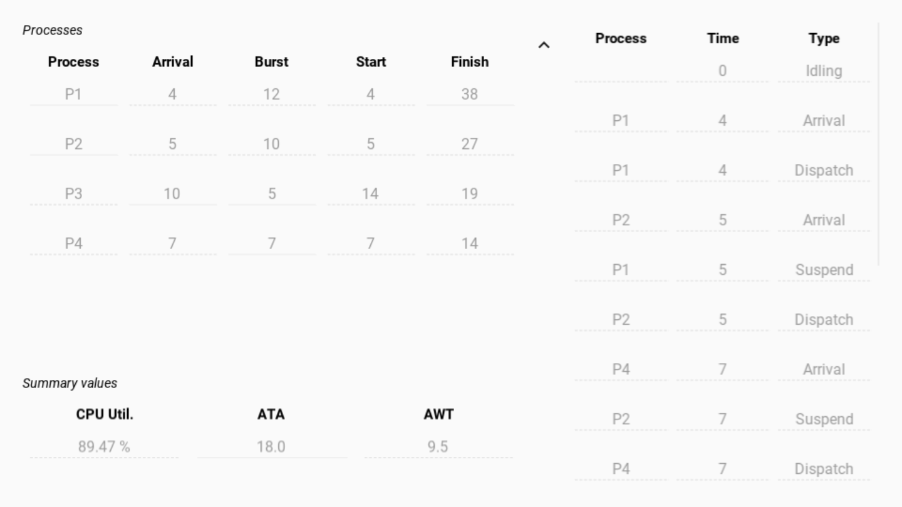

# Shortest Remaining Time First

- Preemptive
  - If busy, CPU is interrupted when a more qualified process arrives
- Processes are executed in turn based on their time of arrival
- Process queue is sorted by descending burst time (shortest to longest)
- When a process arrives that is of smaller burst time than the remaining burst time of the currently executing process, the CPU will be interrupted in favor of this incoming process.

## Screenshots

