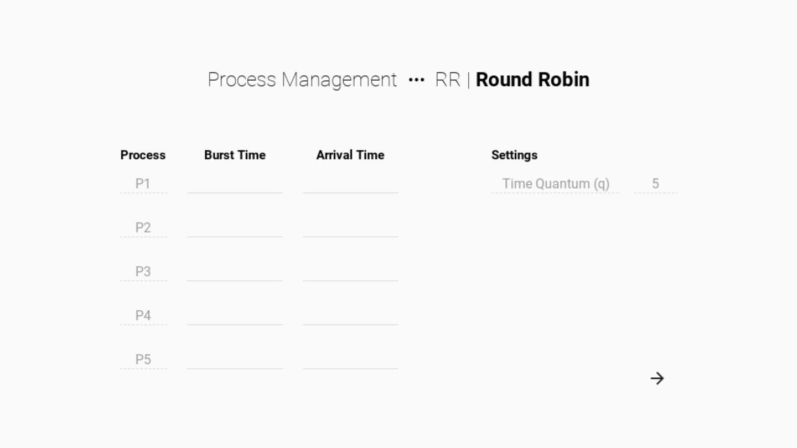
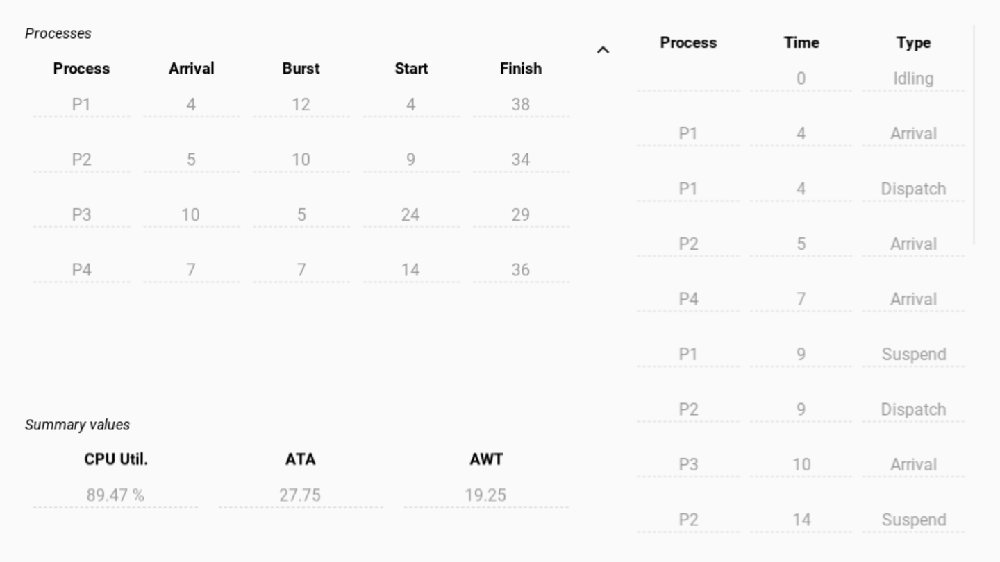

# Round Robin `q = 5`

- Preemptive
  - If busy, CPU is interrupted when a more qualified process arrives
- Processes are executed in turn based on their time of arrival
- Process queue is sorted by descending arrival time (earliest to latest)
- CPU is regularly interrupted every quantum time `q` period
- CPU is shared equally between queued processes

## Screenshots

