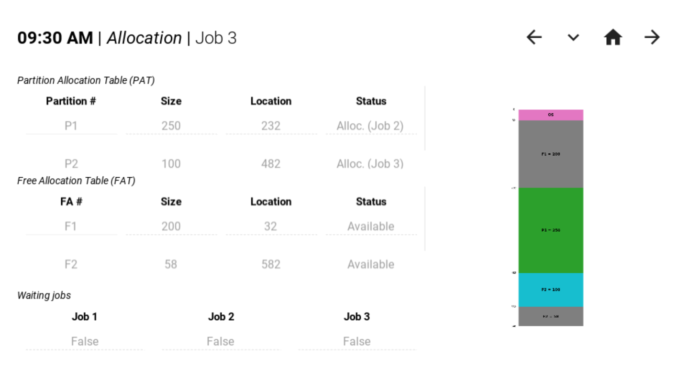

# Memory & Process Managements

<!--
      Description
        Memory and process management simulations in Python using Pandas, Matplotlib, and Kivy.
  -->

A collection of programs simulating different memory and process management types in an operating system, specifically:

- **Memory Management**

  - Single Contiguous memory
  - Static Partitioned memory
  - Dynamic Partitioned memory
    - First Fit
    - Best Fit

- **Process Management**

  - First Come, First Served
  - Shortest Job First
  - Priority Scheduling
  - Shortest Remaining Time First
  - Round Robin

As it currently is, separate programs are built for each management type, written in **Python 3**. They have significant overlaps in terms of functionalities and design, and thus is likely possible to consolidate into a single program.

<!--

## Instructions / Specifications

...

  -->

## Screenshots

#### Memory Management




#### Process Management


_More screenshots are available on each program subdirectory READMEs._

## Packages used

- **Kivy | KivyMD**
  - Graphical user interface (GUI)
- **Pandas**
  - Data representation
  - Vectorized operations
- **Matplotlib**
  - Charts
- **PyInstaller**
  - Executable bundling
- **Black**
  - Opinionated formatting
- **Flake8**
  - Linting

## Running

1. Clone this repository

   ```bash
   git clone https://github.com/mark-P0/memory-process-management
   cd memory-process-management
   ```

2. Create and activate a virtual environment

   ```bash
   ## Create the virtual environment through Python's `venv`
   python -m venv .venv

   ## Activate the environment through one of the following:
   source ./.venv/Scripts/activate  # Windows
   source ./.venv/bin/activate      # Linux
   ```

3. Install the dependencies

   ```bash
   ## Update Python's packaging tools
   python -m pip install --upgrade pip
   pip install wheel setuptools

   ## Install dependencies
   pip install -r requirements.txt
   ```

4. Navigate to one of the program directories

   ```bash
   cd ./01-MemoryManagement/<PROGRAM_SUBDIRECTORY>

   # - OR -

   cd ./02-ProcessManagement/<PROGRAM_SUBDIRECTORY>
   ```

5. Choose one of two methods:
   - Run the program
     ```bash
     python main.py
     ```
   - Build and run an executable
     ```bash
     pyinstaller main.spec
     ./dist/<EXECUTABLE_NAME>
     ```

## Credits

Attributions for the logos used for the program, from [Freepik's Technology pack](https://www.flaticon.com/packs/technology-129):

- <a href="https://www.flaticon.com/free-icons/memory" title="memory icons">Memory icons created by Freepik - Flaticon</a>
- <a href="https://www.flaticon.com/free-icons/cpu-tower" title="cpu tower icons">Cpu tower icons created by Freepik - Flaticon</a>
